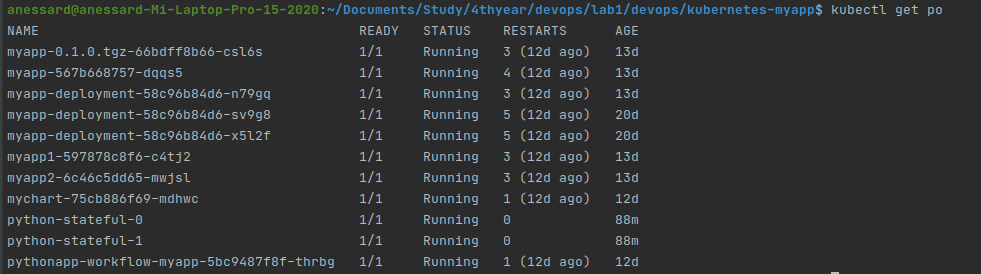
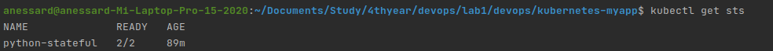
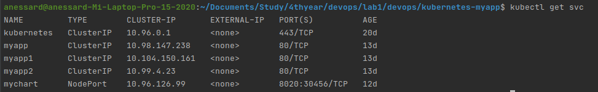
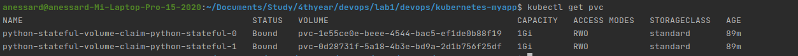
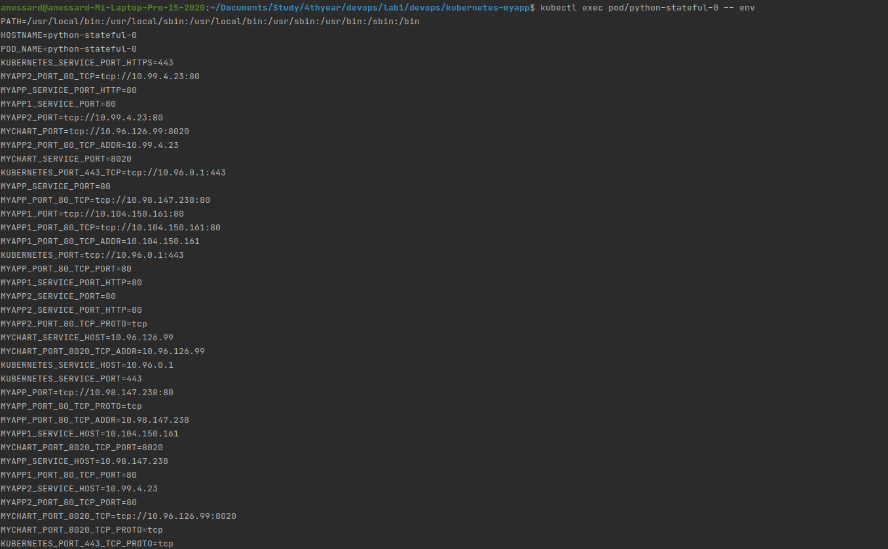

# Lab 13

## Anastassiya Ryabkova

Result of commands 











Actually when using StatefulSet and PersistentVolumeClaim, use the volumeClaimTemplates: field in the StatefulSet. The volumeClaimTemplates: will be used to create unique PVCs for each replica, and they have unique naming ending with e.g. -0 where the number is an ordinal used for the replicas in a StatefulSet.

The reason for the difference in output is that when using statefulsets, each pod is created with a unique identifier and also each pod has its own persistent volume claim as specified in our template. Then the name of the pods itself will not change when we delete it.. it will be static

## Differences between the output of the command for replicas

When we have multiple replcas running in kubernetes we might face some problemes.

When using StatefulSet and PersistentVolumeClaim, use the volumeClaimTemplates: field in the StatefulSet. The volumeClaimTemplates: will be used to create unique PVCs for each replica, and they have unique naming ending with e.g. -0 where the number is an ordinal used for the replicas in a StatefulSet.

The reason for the difference in output is that when using statefulsets, each pod is created with a unique identifier and also each pod has its own persistent volume claim as specified in our template.

##  For our app ordering guarantee are unnecessary explanation

Because all of our pods have a unique data, they do not depend on each other, so our app ordering guarantee are unnecessary.

We can use to launch all pods

```kubectl create -f statefulset.yml ```

This commands to terminate all pods

```kubectl get statefulset```

```kubectl delete statefulset name-your-statefulset```

