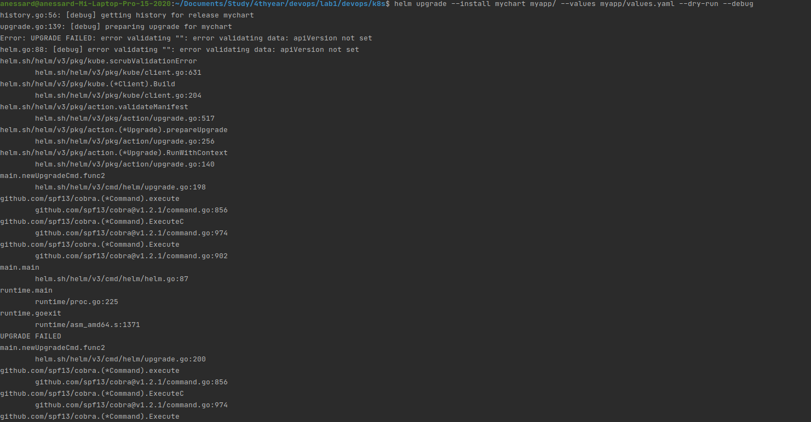
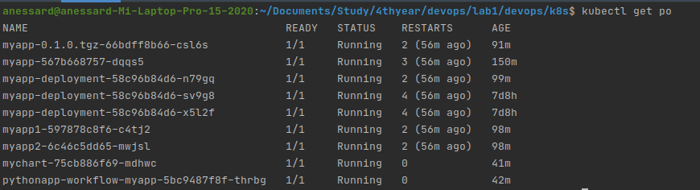
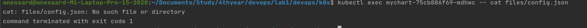

# Lab 12

## Anastassiya Ryabkova

I tried to follow all the steps but there are error that I could not solve

I tried to debug however it did not provide me any explanation

Some commands, kubectl delete pod does not work for some reason

 