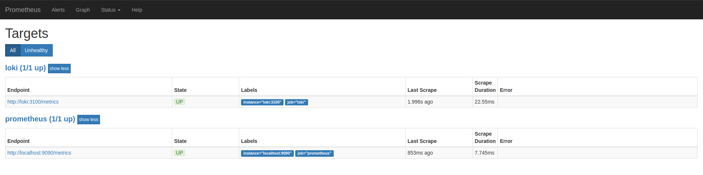
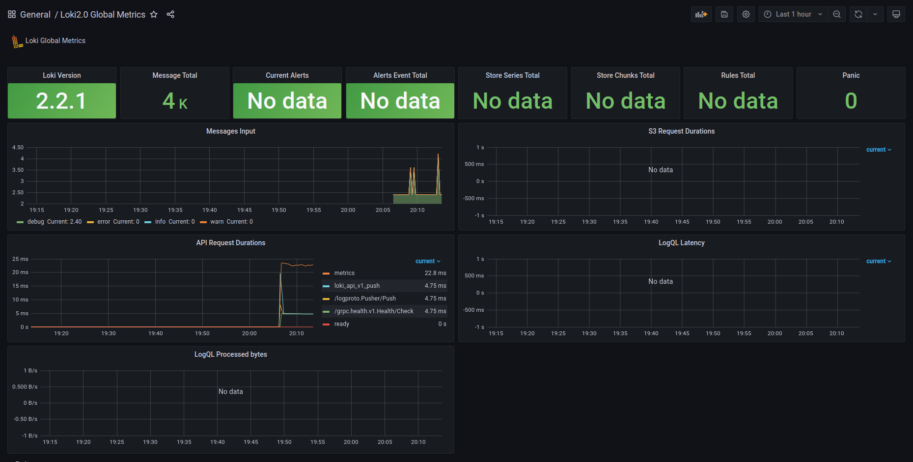
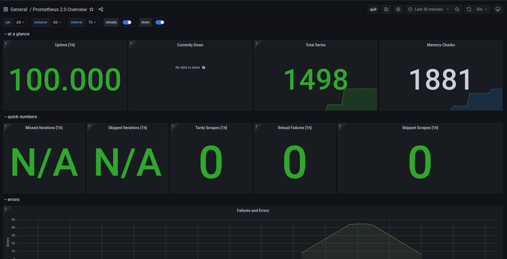

# Logging best precatices

Anastassiya Ryabkova

BS18-SE2

# Logging

- Use a standard and easily configurable logging framework.
- Use a logging framework with flexible output options.
- Use a standard structured format like JSON.
- Create a standard schema for your fields.
- Don't let logging block your application.
- Use a standard library or wrapper for portability.
- Beware that environments like Heroku and Docker set restrictions on host access, syslog daemons, and more
- Automatically parse your logs at ingestion.
- Set up common searches, dashboards, and alerts for your team.

Reference: 

[https://www.scalyr.com/blog/the-10-commandments-of-logging/](https://www.scalyr.com/blog/the-10-commandments-of-logging/)

# Loki and Grafana

- Static labels are good like, host, application, and environment
- Use dynamic labels sparingly
- Label values must always be bounded
- Be aware of dynamic labels applied by clients
- Logs must be in increasing time order per stream
- Use `chunk_target_size`
- Use `print-config-stderr` or `log-config-reverse-order`

Reference:

[Best practices](https://grafana.com/docs/loki/latest/best-practices/)

Success image:

Lab 8 result of http://localhost:9090/targets:

Lab 8 result add 13407 dashboard:

Lab 8 result add 3662 dashboard:

